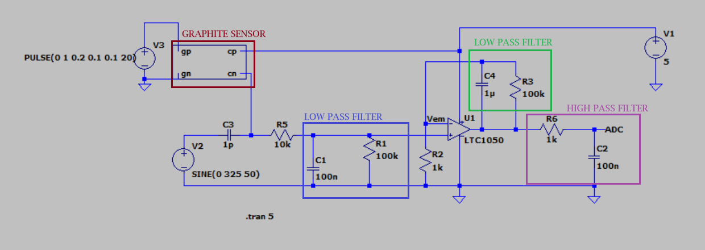
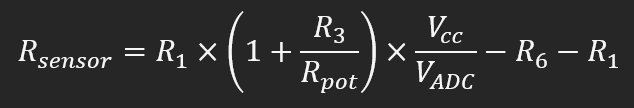
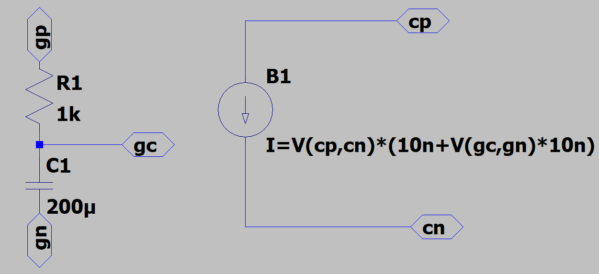
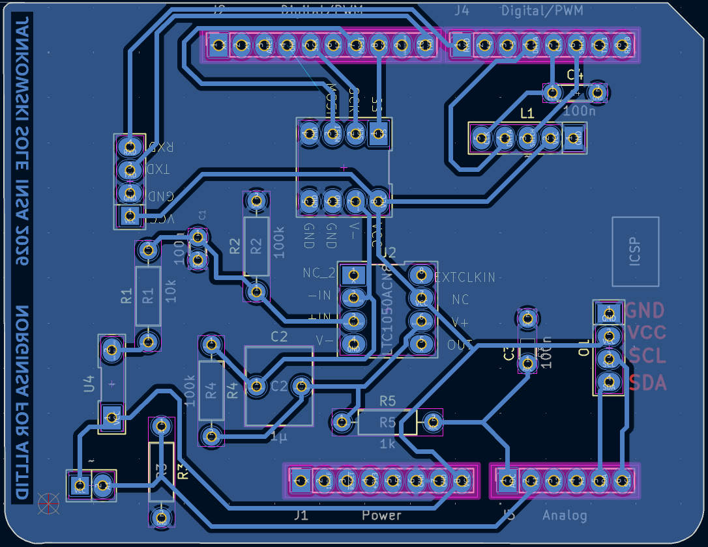
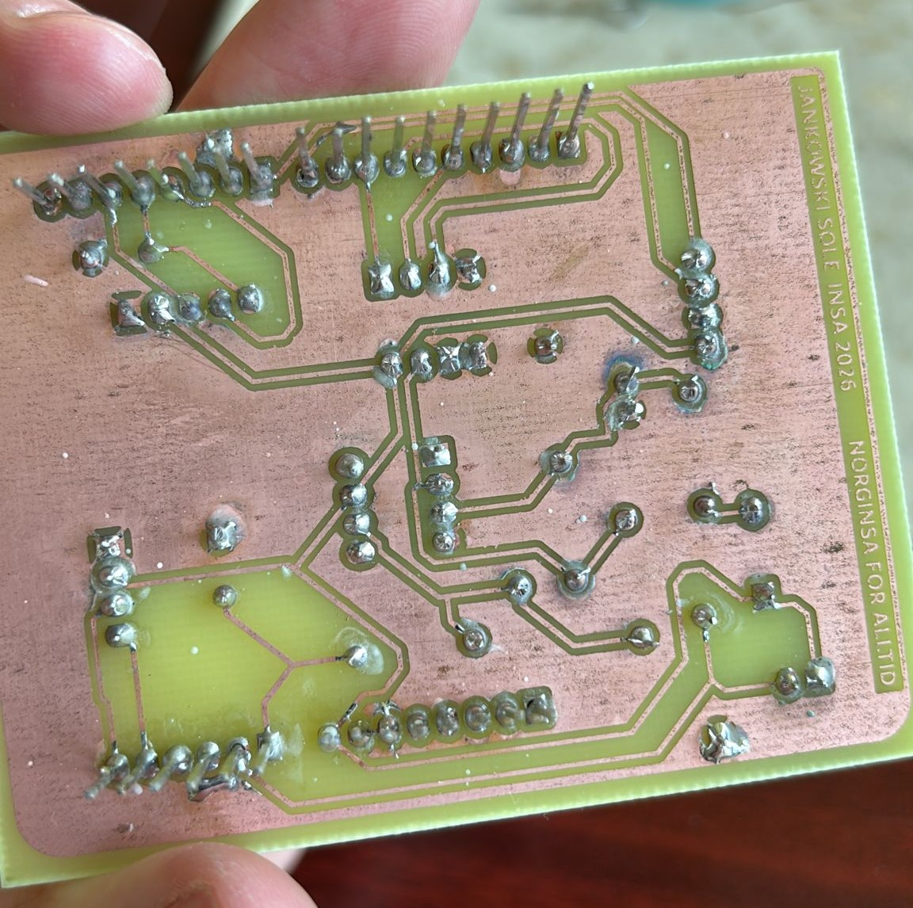
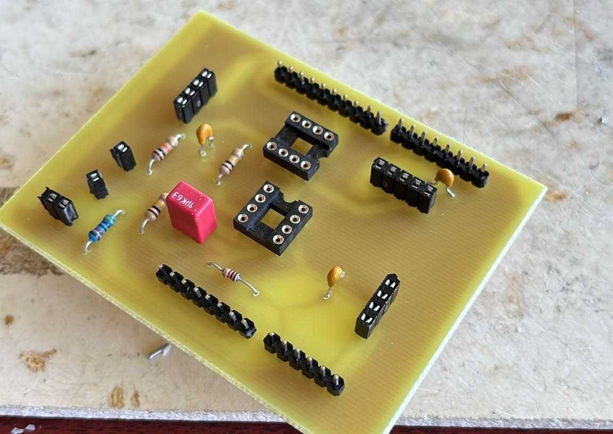
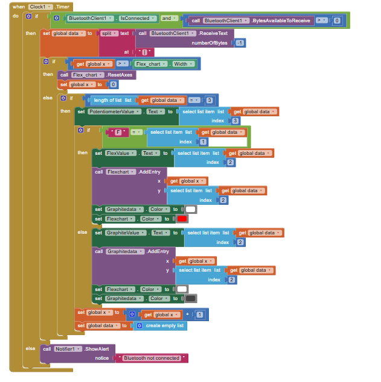
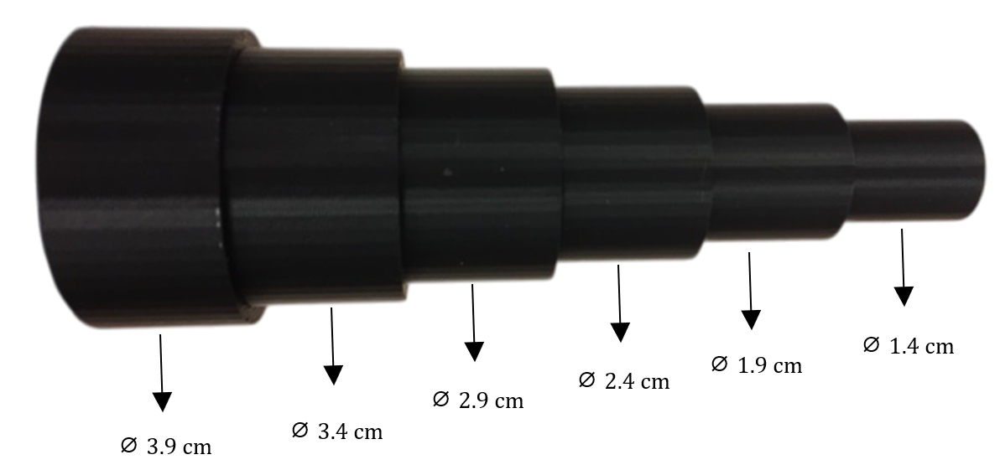

# 2025-2026-4GP-SOLE-JANKOWSKI

## *Low-tech graphite-based tactile sensor*
### Content list

- [Introduction](#introduction)

- [Deliverables](#deliverables)

- [Materials used in this project](#materials-used-in-this-project)

- [Circuit simulations on LTSpice](#circuit-simulations-on-ltspice)

- [Modelling the PCB with KiCad](#modelling-the-pcb-with-kicad)

- [Physical realisation of the PCB](#physical-realisation-of-the-pcb)

- [Arduino code](#arduino-code)

- 

- [Contact the developers](#contact-the-developers)

---

### Introduction  
The aim of this project is to study a low-tech graphite-based tactile sensor. This work is inspired by the "[Pencil Drawn Strain Gauges and Chemiresistors on Paper](https://www.nature.com/articles/srep03812)" by Cheng-Wei Lin, Zhibo Zhao, Jaemyung Kim and Jiaxing Huang.

The research states that graphite pencil traces left on paper can act as strain gauges. As the strain is applied, the graphite structure changes, which in turn modifies the electrical resistance in the material.

A PCB was developed from scratch in order to study the graphite-based sensor which was then controlled via an Arduino UNO. The main purpose of the board is to amplify the very weak current flowing through the graphite-based sensor. Furthermore, a digital potentiometer was integrated into the circuit, allowing fine tuning of the measurement setup. In addition, a commercial flex sensor was added, whose resistance varies with the angle, providing a comparative reference for our low-tech counterpart. For practical reasons, a Bluetooth component will serve as a means of transmitting the data collected throughout the usage, as well as an OLED screen that will display (...) 

This project encompasses the full development cycle, including electronic simulations in LTSpice, PCB design with KiCad, Arduino programming, application development using MIT App Inventor, and the creation of a technical datasheet.

---

### Deliverables 
  • A PCB shield connected to an Arduino UNO, which includes : an amplifier circuit, a graphite-based sensor, an OLED screen, a Bluetooth module, a commercial flex sensor and a rotary encoder.\
  • An Arduino code which controls the PCB.\
  • A mobile application which collects data from the Arduino.\
  • A datasheet detailing the characteristics of the graphite-based sensor.\
  • A test bench for the writing of the datasheet.

  ---

### Materials used in this project:
  - Arduino Uno  
  - Bluetooth module (HC-05)  
  - Capacitors (1µF and 100nF)
  - Digital potentiometer (MCP41050)  
  - Flex sensor  
  - Graphite-based paper sensor  
  - OLED display  
  - Operational amplifier (LTC1050)  
  - Resistors (1kΩ, 10kΩ and 100kΩ)
  - Rotary encoder (KY-040)  

  For further information and visualisation, please follow this [link](./Components/(... legge til her)) 

---

### Circuit simulations on LTSpice
As the objective of our project is to study the graphite-sensor, the measurement of the current flowing through it will be rather low (nA), with a variable resistance in the order of gigaohm (GΩ) for a potential of 5V from the Arduino. Hence, we have implemented a transimpedence amplifier circuit which will convert the current in the graphite sensor into a measurable voltage. 

Figure 1 : Amplifier circuit with underlined graphite sensor and filter parts

In order to optimize the performance of the circuit, three filters are introduced.
-  Activ low-pass filter around R3 and C4 with cutoff frequency of 1.6 Hz that filters the frequency generated by the power         grid (50 Hz).
-  Input : Passive low-pass filter around R1 and C1 with cutoff frequency of 16 Hz that filters out the current 
    noise from the input.
-  Output : Passive low-pass filter around R6 and C2 with cutoff frequency of 1.6 kHz that filters out the noise from within        the circuit.

Other information to keep in mind is that the R2 resistance is a digital potentiometer (MCP41050) with a maximal ohm value of 50kΩ. Furthermore, the operationel amplifier LTC1050 will be used in our circuit, which has properties such as handling low input currents and low voltage offset, ideal for our application.

With this circuit we deduce the sensors resistance with : 

Figure 2: Dependence of the R sensor value

Figure 3 : The graphite sensor modelling on LTSpice

---

### Modelling the PCB with KiCad

We have designed our PCB with the help of KiCad (9.0) It is an open source software used for electronic design automation. KiCad provided access to tools for PCB development such as : creating our own PCB layout, 3D visualisation and adding our own components, here notably the graphite sensor. We used two main playfields for our PCB development, the **electrical diagram** and the **routing layout and footprints**

The PCB acts as a shield extension for the Arduino UNO and contains components such as :
- Bluetooth module (HC-05) for datatransfer
- OLED display for visualisation
- Graphite sensor and the corresponding amplifier circuit
- Flex sensor for comparing
- Rotary encoder (KY-040) for steering the OLED

The work with the KiCad software began with integrating all of the above mentioned parts into the electrical diagram. In some cases custom symbols had to be created, since they were non existent on the KiCad libraries.

Furthermore, as seen on the image bellow, the electrical diagram encompasses the work of defining electrical connections between components and ensuring compatibility withe the Arduino UNO pins, which was selected as the default base for our shield.

Figure 4: Electrical circuits and components

Using the current digram, we move on to creating the footprints, also known as the physical representations for the components added into the, what is to become, physical PCB. This will ensure compatibility between our designed electrical diagram and the PCB.

Figure 5: Electrical footprint

Additionally, we had 3D models associated with footprints, enabling visualisation of the final PCB.

Finally came the most tricky part, *routing*. We had to place the components strategically, as to minimize the use of vias and connect all of the components, which sounds easier said than done.This part also includes adding the specific drilling size to match the physical components.

Figure 7 : Routing which connects the different components 

In the end we generated a file which contained the copper layer information for creating the mask the physical realisation of the PCB 

---
### Physical realisation of the PCB

With the help of Catherine Crouzet we not only went through the prepared the board ready for drilling and soldering, but also learned about the process. 

The process starts with the preparation of the copper coated epoxy board covered with photosensitive resin and laying our mask on it. We then applied UV light to harden the selected areas of the resin. This board was then immersed in a developer solution to remove the unwanted copper and exposed resin. Acetone was used to remove the remaining copper. (gå gjennom med maisen). At the elec room we drilled holes and soldered the corresponding components.

Figure 8 and 9 : Back- and front-end of the shield

**To keep in mind :** after soldering some plastic parts may boil and cause communication problems. These may occur hours or even days after soldering.

---
### Arduino code

The Shield is controlled through an IDE Arduino 2.3.6 program. The main code controls the hardware with both measurements and a simple user interface. The OLED display has the following look : 

Here we are able to choose between three different windows. 

1. DigiPot : Short for Digital Potentiometer, this allows us to vary the resistance values of the digital potentiometer (MCP41050) which in turn varies the amplification ([Figure 2](#)). 
 
2. Modes : Lets the user choose between measurements of the graphite sensor or the Flex sensor.

3. Github : Contains the link to [our](https://github.com/MOSH-Insa-Toulouse/2025-2026-4GP-SOLE-JANKOWSKI.git) github page.

Navigation through the OLED display is done when rotating the rotary encoder. Pressing it inwards allows the user to enter the selected window. Pressing it again, will exit the current window. There is a certain delay, added by us, in order to avoid any unwanted jumps. Therefore, please be patient with pressing inwards and rotating the encoder. 

We have used the following libraries to ensure compatibility with our hardware. 
- *Adafruit_SSD1306.h* as the library for communication with the OLED
- *SPI.h* as the library for handling the digital potentiometer
- *Software serial.h* for the bluetooth handling, BUT only present in the [Bluetooth_code](legge til bluetooth filen til Joan) file.

See the code [here](./Arduino%20Code/main_code.ino) for further information on each part of the code

### Application

To characterize and compare the commercial Flex sensor with our custom graphite sensor in real-time, we developed a mobile application using MIT App Inventor [Link]. As shown in the figure below, the intuitive interface consists of:

- Bluetooth Connection: A button to connect and view the list of available devices.
- Real-time Plotting: Three indicators displaying values for the digital potentiometer (adjusted by the rotary encoder and OLED), the flex sensor resistance, and the graphite sensor resistance. real-time graph that visualizes data from either the flex sensor or the graphite sensor, depending on the operation mode selected on the OLED

These are the blocs used to open Bluethooth communication with our Bluetooth Module HC05 and initiate some variables.

These ones are in charge of the real time plotting and sequenciation of date recived.

### Datasheet

You can find the datasheet of the graphite sensor here[link].

### Test Bench

The purpose of this test bench is to determine the sensor's sensitivity, study its behavior, and then compare it to a commercial 'Flex-Sensor'. To achieve this, we used the following test bench, which consists of six circles with diameters ranging from 1.4 to 3.9 cm. This test bench was 3D printed.

This setup allows us to measure the relative change in resistance (ΔR/R₀) as a function of strain (ε), defined by the formula ε = e/D, where 'e' is the thickness of the sensor (in this case, the thickness of the paper sheet, which is 0.2 mm) and 'D' is the diameter of the specific circle.

We conducted tests to evaluate their performance under both tensile and compressive strain. Additionally, we used three different pencil grades (6B, 3B, and HB) to observe how the graphite's tone impacts the sensor's sensitivity, as well as its relationship to graphite density and the availability of conductive pathways.
To prevent signal saturation, we dynamically adjusted the amplification using the digital potentiometer, ensuring a baseline reading of 2.5 VDC when the sensor was perfectly flat.

---
### Contact the developers 
Wiktor JANKOWSKI : jankowski@insa-toulouse.fr   
Joan SOLÉ : sole-lohan@insa-toulouse.fr  
